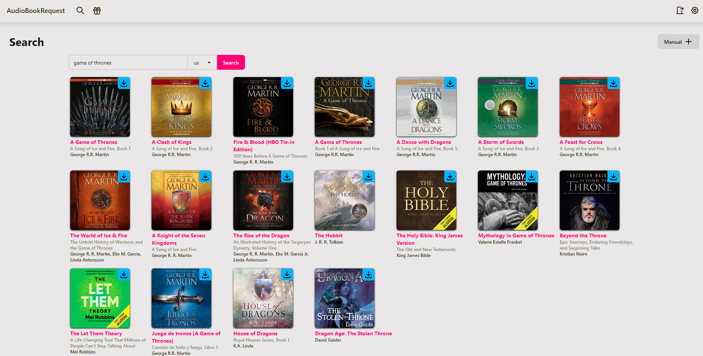

# Rough TODO

- [ ] Add option to remove requests on wishlist page
- [ ] Docker

# Local Development

## Installation

```sh
python -m venv .venv
.venv/activate
pip install -r requirements.txt
```

## Initialize DB

```sh
alembic upgrade heads
```

## Running

Running the application is best done in multiple terminals:

1. Start FastAPI dev mode:

```sh
fastapi dev
```

2. Install daisyUI and start Tailwindcss watcher:

```sh
npm i
tailwindcss -i styles/globals.css -o static/globals.css --watch --m
```

3. Start browser-sync. This hot reloads the website when the html template files are modified:

```sh
browser-sync http://localhost:8000 --files templates/**
```

**NOTE**: Website has to be visited at http://localhost:3000 instead.
