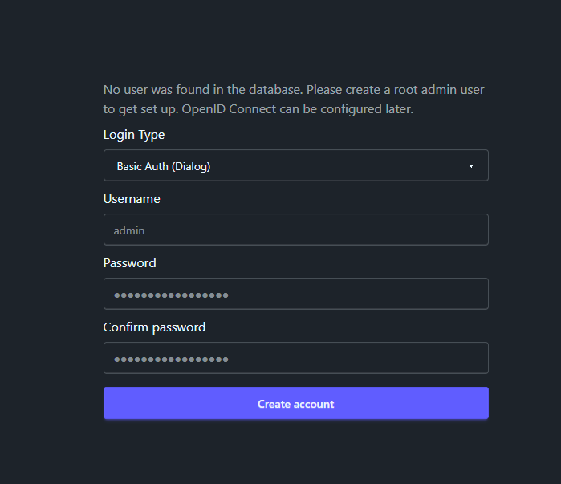

Once you get AudioBookRequest running, you'll be greeted with an initialization
page when you visit the website.

On this page you have to set the type of login you want to use for the app and
then create the login details for the root admin. You can choose from 3 login
types on this page:

- **Basic Auth:** This is the most simple form of login. Your browser will show
  a popup login dialog which will then be used to log in to the site. Password
  managers usually don't work for this type of login, but because it is very
  simple you can also easily send authenticated requests in scripts.
  [Read more here](https://en.wikipedia.org/wiki/Basic_access_authentication).
- **Forms:** This is the standard type of login where you fill out a login-form.
  Password managers usually work with this.
- **None:** This turns off all authentication. This is best if you have a proxy
  and are the only user or you don't mind everyone having root access to the
  site.

 AudioBookRequest supports logging in with
OpenID Connect. You'll have to first select one of the login-types above to be
able to adjust the OIDC settings. Head to the
[OIDC Tutorial](../../tutorials/oidc) for more info. 

 Even if you intend to turn off all
authentication or want to later use OIDC, you should take note of the
username/password you set. You'll need them once you decide to ever change the
login type. 
