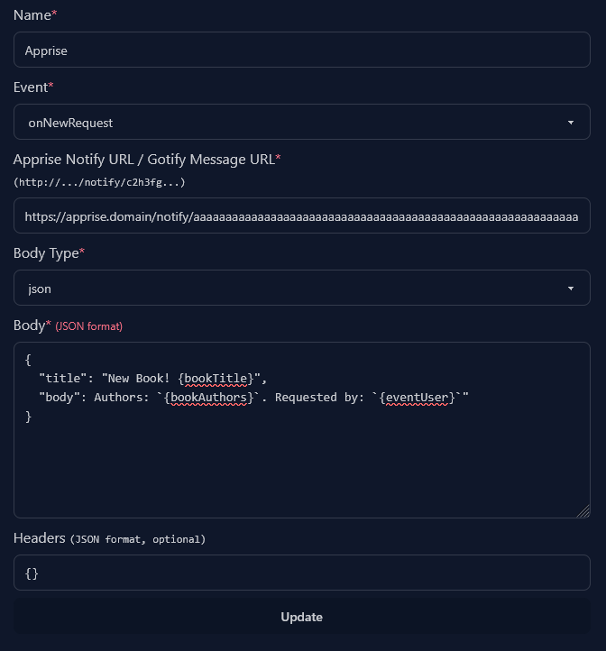
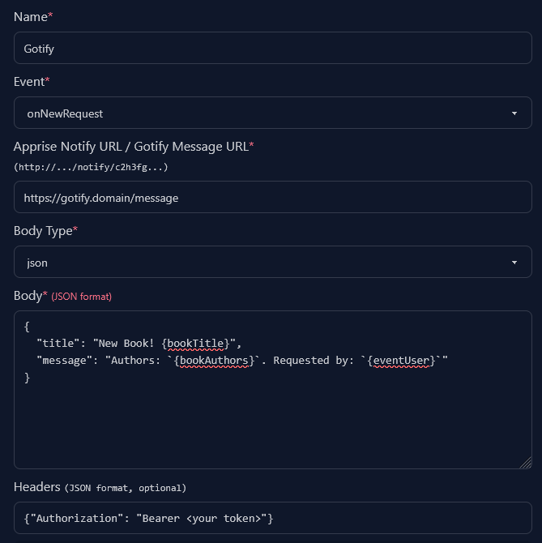
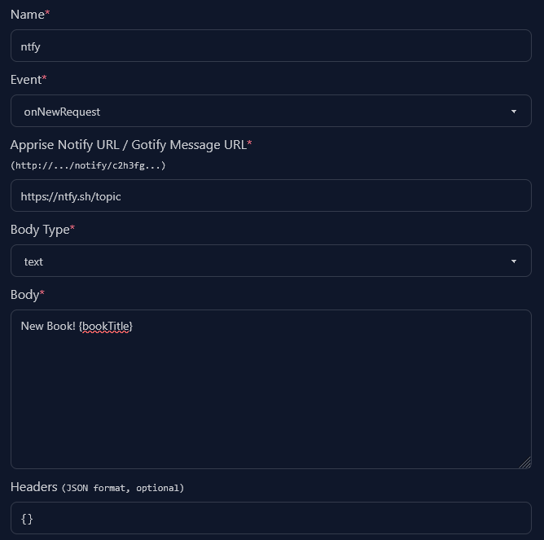
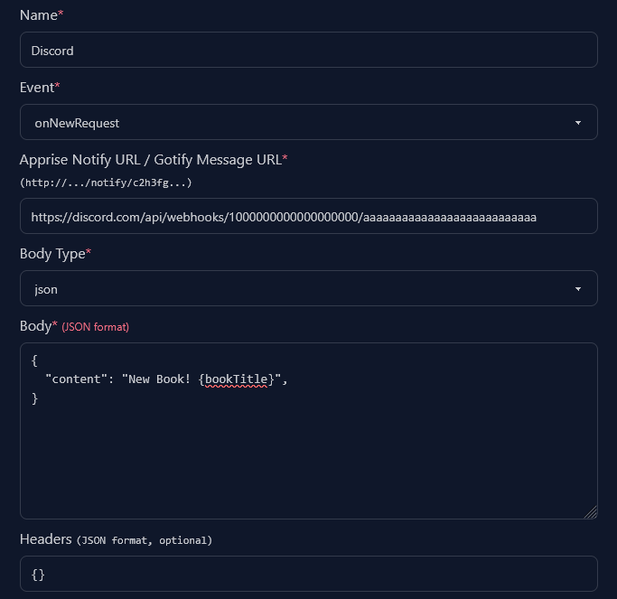

Notifications allow you to send a POST request/webhook wherever you want. ABR
works with all major notification systems like apprise, gotify, ntfy, and
discord.

Here are a few examples for how the notifications body looks for different
notification systems:

## Apprise

For apprise you'll want to have the title in `"title"` and the message body in
`"body"`.

## Gotify

For gotify you'll want to have the title in `"title"` and the message body in
`"message"`. Gotify also requires you to pass in your authorization token in the
header.

## Ntfy

Ntfy does not differentiate between title and body. You'll want to select the
`text` body type and then add your message.

## Discord

You can send notifications to discord by using webhooks. Discord allows you to
send plain messages or create bigger messages with embeds.

To make better looking webhook messages you can also use a message builder like
one of the following pages:

- https://message.style/app/editor (Copy the JSON code)
- https://discohook.app (`Options>JSON Editor` to export)

