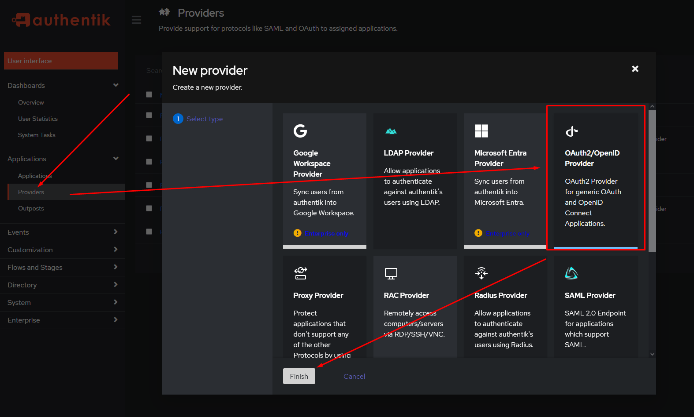
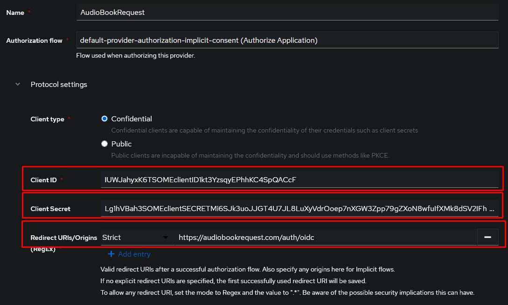
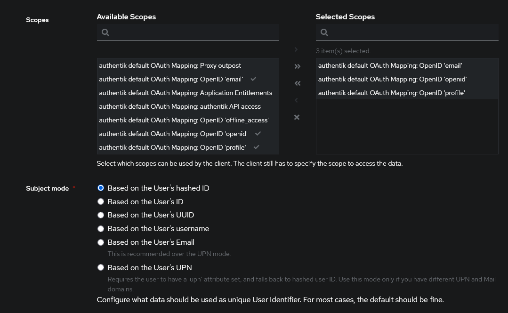

OIDC allows you to use the same login across multiple apps. This guide will show
you how to set up OIDC with Authentik, but the concepts are the same or similar
for other providers.

## Setup a provider on Authentik

1.  You want to first create an application on Authentik. The settings here
    don't play a role for AudioBookRequest though.

2.  You then want to create an OAuth2/OpenID Provider:

    

3.  Configure the settings as preferred. The important two values are the
    `Client ID` and `Client Secret`. Take note of those. You should also set the
    redirect URL that the OIDC provider will redirect you to after a succesful
    login. This has to be the domain of your ABR instance with `/auth/oidc`
    appended.

    

     Make sure you correctly set
    `http` or `https` in the redirect URL. This depends on how you access
    AudioBookRequest. 

4.  Set the scopes that ABR can get access to. You should always allow for the
    `openid` scope. Any other scopes are optional. You'll have to check with
    your OIDC provider to see what what scopes are required to get a
    name/username and groups. "Subject mode" is a unique identifier for the
    user. This can be used as the username on ABR.

    

5.  Assign your newly created provider to the ABR application.

## Setup settings in ABR

1. On AudioBookRequest, head to `Settings>Security` and set the "Login Type" to
   "OpenID Connect".
2. Paste the "Client ID" and "Client Secret" into the respective fields.
3. Your "OIDC Configuration Endpoint" depends on the OIDC provider you use. For
   Authentik, it's usually along the lines of
   https://domain.com/application/o/audiobookrequest/.well-known/openid-configuration.
   You'll have to find that for your own provider. Visiting the url should give
   you a JSON-formatted object with different endpoints and details given.
4. The "OIDC Scopes" are the ones defined above separated by a space. `openid`
   is always required. Any other scopes like `email` or `group` are only
   required if you intend to use the email for the username or respectively
   extract the group of the user.
5. "OIDC Username Claim" **has to be a unique identifier** which is used as the
   username for the user. `sub` is always available, but you might prefere to
   use `email` or `username` (with the correctly added scope).
6. Depending on what you used above for the redirect URL, set `http` or `https`.
    `http/s` has to match-up with
   what protocol your redirect-url uses. Providers _will_ reject logins if this
   does not match up. 
7. _Optional_: The "OIDC Logout URL" is where you're redirected if you select to
   log out in ABR. OIDC Providers allow you to invalidate the session on this
   URL. While this value is optional, not adding it might break logging out
   slightly because the session can't properly be invalidated.

## Groups

"OIDC Group Claim" is optional, but allows you to handle the role distribution
of users in your OIDC provider instead of in ABR. The exact claim that sends
along the information depends on your OIDC provider. The OIDC provider can
provide a single string or list of strings.

The groups have to be named exactly one of `untrusted`, `trusted`, or `admin`.
The letter case does not matter.

 For Authentik, the group claim name is `groups` and requires the
`profile` scope. If you assign a user to a group named `trusted`, that user will
receive the `Trusted` role once they login to AudioBookRequest. 
